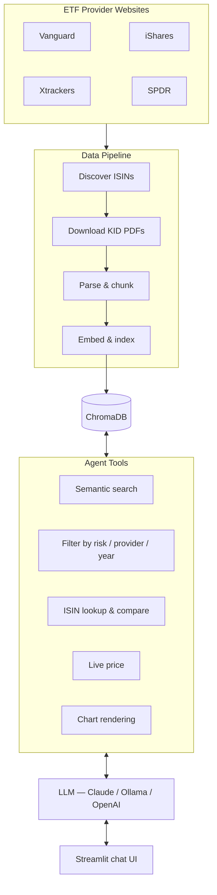

# kid-mind

An AI-powered European ETF research assistant grounded in official PRIIPs KID (Key Information Document) data. Ask anything about European ETFs — costs, risks, holdings, comparisons, live prices, or provider coverage. Currently covers **1,400+ funds** across 4 major providers: Vanguard, iShares, Xtrackers, and SPDR.

## What problem does this solve?

European investors face a fragmented landscape: over a thousand ETFs spread across multiple providers, each publishing standardised but hard-to-compare KID documents. Reading through hundreds of PDFs to find the cheapest S&P 500 tracker, compare risk levels, or understand what a fund actually invests in is impractical.

kid-mind automates the entire pipeline — from discovering and downloading those documents, to parsing and indexing them, to answering natural-language questions backed by the official data. Instead of manually opening PDFs, you ask questions like:

- *"What are the cheapest equity ETFs from iShares?"*
- *"Compare costs of S&P 500 trackers across all providers"*
- *"Which funds have risk level 2 or lower?"*
- *"What does the Xtrackers MSCI World ETF invest in?"*

Every answer is grounded in the actual KID documents — no hallucination, no guesswork.

## Architecture overview



## Components

### Data pipeline

Three phases turn provider websites into searchable vectors:

**1. ISIN discovery** — finds every ETF each provider offers. Vanguard and iShares require Playwright (browser automation) because their sites are JS-heavy. Xtrackers and SPDR use plain HTTP against sitemaps — much faster. Output: `data/isins/<provider>.json`.

**2. KID download** — fetches the actual PDFs via direct HTTP (no browser). Each provider has a different URL pattern. Downloads are resumable and validated (`%PDF-` header, minimum 5 KB). Success rates range from ~81% (Vanguard) to ~99% (iShares). Output: `data/kids/<provider>/<ISIN>.pdf`.

**3. Chunking and indexing** — transforms PDFs into searchable knowledge:

- [Docling](https://github.com/DS4SD/docling) converts PDFs to Markdown (preserves tables, headings, layout)
- Regex splits the Markdown into EU-mandated KID sections (product description, risks, costs, etc.)
- [Chonkie](https://github.com/chonkie-ai/chonkie) semantically sub-chunks each section at natural topic boundaries
- Metadata is extracted (product name, risk level 1-7, launch year, document date)
- Chunks are embedded and upserted into ChromaDB with a metadata prefix for fund identity

**Chunking trade-offs:** Section-first splitting respects the document's logical structure — cost queries hit cost sections, not product descriptions — and enables precise metadata filters. The downside is it depends on consistent EU headings (non-standard formatting falls back to the full document as one chunk) and the two-pass approach is slower than single-pass chunking.

### ChromaDB

[ChromaDB](https://www.trychroma.com/) stores chunks with embeddings and structured metadata, enabling hybrid queries — semantic search combined with exact filters like provider or risk level.

Embedding models are pluggable — any OpenAI-compatible API (Ollama, LiteLLM, OpenAI) or local sentence-transformers. The model must match between indexing and query time.

### Reranking

Optional cross-encoder reranking improves search precision. Vector search embeds queries and documents independently; a cross-encoder reads them *together* for more accurate scoring — but it's too slow for the whole collection. So: over-fetch 3x candidates from ChromaDB, rerank with the cross-encoder, keep the top N. Falls back gracefully if the reranker is unavailable.

Configure via `RERANKER_ENABLED` and `RERANKER_MODEL` in `.env`.

### Agent and tools

Two interchangeable agent backends, both exposing the same tools:

- **PydanticAI** (default) — connects to any OpenAI-compatible LLM (Ollama, LiteLLM, OpenAI). Recommended for local deployments.
- **Claude Agent SDK** — uses Anthropic's Claude with extended thinking. Requires `ANTHROPIC_API_KEY`.

Available tools: semantic search, metadata filtering (risk/provider/launch year), provider listing, single and multi-ISIN lookup, live price via OpenFIGI + yfinance, and chart rendering.

The system prompt keeps the agent grounded — it only answers from retrieved documents, never guesses.

### Streamlit app

Chat UI built with [Streamlit](https://streamlit.io/):

- Welcome screen with clickable example questions across 6 categories
- Conversational chat with message history
- Interactive Plotly charts (bar, pie) rendered inline when the agent compares data
- Sidebar with provider logos and conversation reset
- Custom CSS theming (blue/grey palette, responsive layout)
- Switch between PydanticAI and Claude backends via `AGENT_BACKEND` in `.env`

### Observability

Optional [Arize Phoenix](https://phoenix.arize.com/) integration exports OpenTelemetry traces for LLM calls, tool usage, and latencies. Set `PHOENIX_COLLECTOR_ENDPOINT` and `PHOENIX_API_KEY` in `.env`.

## Running it locally

### Prerequisites

- **Python 3.10+**
- **[uv](https://docs.astral.sh/uv/)** — Python project and dependency manager
- **Docker** — for running ChromaDB

### Step 1: Clone and install dependencies

```bash
git clone <repo-url> kid-mind
cd kid-mind
uv sync
```

### Step 2: Configure environment

Copy the example and fill in your values:

```bash
cp .env.example .env
```

Edit `.env`:

```bash
# Required: LLM for inference (any OpenAI-compatible endpoint)
OPENAI_API_BASE=http://localhost:11434/v1   # e.g. Ollama
OPENAI_API_KEY=ollama                       # dummy key for Ollama (required but not validated)
OPENAI_MODEL=qwen3:30b                     # or any model your endpoint serves

# Required: ChromaDB connection
CHROMADB_HOST=localhost
CHROMADB_PORT=8000

# Embeddings: choose one approach
# Option A: OpenAI-compatible API (same endpoint as above, or different)
EMBEDDING_MODEL=nomic-embed-text            # model name your endpoint serves
# Option B: Leave OPENAI_API_KEY blank for local sentence-transformers (all-MiniLM-L6-v2)

# Optional: cross-encoder reranking (improves search precision)
RERANKER_ENABLED=true
RERANKER_MODEL=cross-encoder/ms-marco-MiniLM-L-6-v2

# Optional: Arize Phoenix telemetry
PHOENIX_COLLECTOR_ENDPOINT=
PHOENIX_API_KEY=
PHOENIX_PROJECT=kid-mind

# Optional: Claude Agent SDK backend (requires Anthropic API key)
ANTHROPIC_API_KEY=
AGENT_BACKEND=pydantic   # "pydantic" (default) or "claude"
```

### Step 3: Start ChromaDB

```bash
docker compose up -d
```

Verify it's running:

```bash
curl http://localhost:8000/api/v1/heartbeat
```

### Step 4: Discover ISINs and download KID documents

This uses the kid-collector skill scripts. First, install Playwright (one-time, only needed for Vanguard and iShares discovery):

```bash
uv run --with-requirements .claude/skills/kid-collector/scripts/requirements.txt \
  python -m playwright install chromium
```

Discover all ISINs:

```bash
uv run --with-requirements .claude/skills/kid-collector/scripts/requirements.txt \
  .claude/skills/kid-collector/scripts/discover_isins.py
```

Download all KID PDFs:

```bash
uv run --with-requirements .claude/skills/kid-collector/scripts/requirements.txt \
  .claude/skills/kid-collector/scripts/download_kids.py
```

You can target a single provider and limit downloads:

```bash
# Discover ISINs for Vanguard only
uv run --with-requirements .claude/skills/kid-collector/scripts/requirements.txt \
  .claude/skills/kid-collector/scripts/discover_isins.py -p vanguard

# Download max 10 KIDs from SPDR
uv run --with-requirements .claude/skills/kid-collector/scripts/requirements.txt \
  .claude/skills/kid-collector/scripts/download_kids.py -p spdr -m 10
```

### Step 5: Build the ChromaDB index

Parse all downloaded KIDs, chunk them, and upsert into ChromaDB:

```bash
uv run python chunk_kids_cli.py
```

This takes a while (Docling PDF parsing is CPU-intensive). You can process a single provider first to get started quickly:

```bash
uv run python chunk_kids_cli.py -p xtrackers -m 50
```

Other useful options:

```bash
# JSON debug output only, no ChromaDB needed
uv run python chunk_kids_cli.py --skip-chromadb --dump-json

# Patch metadata on existing chunks without re-indexing
uv run python chunk_kids_cli.py --patch-metadata
```

### Step 6: Run the Streamlit app

```bash
uv run streamlit run streamlit_app.py
```

Opens at `http://localhost:8501`. Ask questions, compare ETFs, render charts.

### Alternative: CLI agent

For a terminal-based experience:

```bash
# Interactive conversation
uv run python agent_cli.py

# One-shot query
uv run python agent_cli.py -q "What are the cheapest S&P 500 ETFs?"
```

Note: The CLI agent uses the Claude Agent SDK backend and requires `ANTHROPIC_API_KEY`.

## Keeping data up to date

Check for new or updated KID documents:

```bash
# Re-discover ISINs (new funds may have been added)
uv run --with-requirements .claude/skills/kid-collector/scripts/requirements.txt \
  .claude/skills/kid-collector/scripts/discover_isins.py

# Check for updated documents
uv run --with-requirements .claude/skills/kid-collector/scripts/requirements.txt \
  .claude/skills/kid-collector/scripts/update_kids.py

# Re-index changed documents
uv run python chunk_kids_cli.py
```

## Running tests

```bash
# All tests
uv run python -m pytest tests/ -v

# Tool function tests only
uv run python -m pytest tests/test_tools.py -v

# Specific test class
uv run python -m pytest tests/test_tools.py::TestGetEtfPrice -v
```

## Project structure

```
kid-mind/
├── streamlit_app.py               # Streamlit chat UI
├── agent_cli.py                   # CLI agent (Claude Agent SDK)
├── chunk_kids_cli.py              # Chunking pipeline CLI
├── src/kid_mind/                  # Core application package
│   ├── config.py                  # All configuration (env vars)
│   ├── prompt.py                  # Agent system prompt
│   ├── parser.py                  # PDF → markdown → sections → chunks
│   ├── tools.py                   # ChromaDB tools (search, filter, price)
│   ├── agent.py                   # Claude Agent SDK wrapper
│   └── agent_pydantic.py          # PydanticAI agent wrapper
├── assets/                        # UI assets (logos, CSS)
├── data/
│   ├── isins/                     # Discovered ISINs (JSON per provider)
│   ├── kids/                      # Downloaded KID PDFs
│   └── chunks/                    # Debug JSON output
├── tests/                         # Test suite (83+ tests)
├── docker-compose.yml             # ChromaDB service
├── pyproject.toml                 # Dependencies and project config
└── .claude/skills/kid-collector/  # ISIN discovery and KID download scripts
```

## License

This project is for research and educational purposes. KID documents are public regulatory disclosures published by fund providers under EU PRIIPs regulation.
