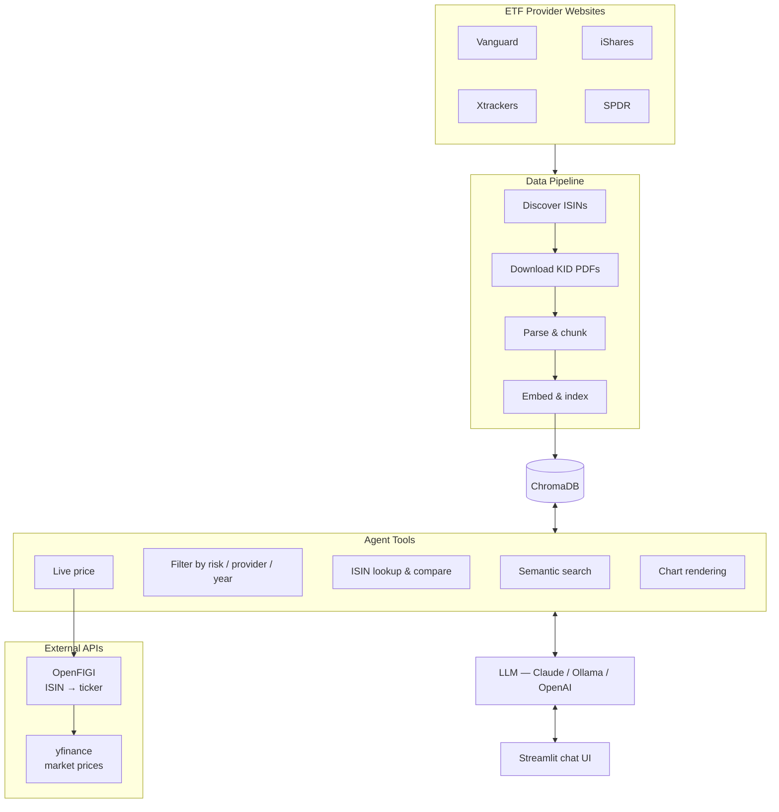

# kid-mind

An AI-powered European ETF research assistant grounded in official PRIIPs KID (Key Information Document) data. Ask anything about European ETFs — costs, risks, holdings, comparisons, live prices, or provider coverage. Currently covers **1,400+ funds** across 4 major providers: Vanguard, iShares, Xtrackers, and SPDR.

## What problem does this solve?

European investors face a fragmented landscape: over a thousand ETFs spread across multiple providers, each publishing standardised but hard-to-compare KID documents. Reading through hundreds of PDFs to find the cheapest S&P 500 tracker, compare risk levels, or understand what a fund actually invests in is impractical.

kid-mind automates the entire pipeline — from discovering and downloading those documents, to parsing and indexing them, to answering natural-language questions backed by the official data. Instead of manually opening PDFs, you ask questions like:

- *"What are the cheapest equity ETFs from iShares?"*
- *"Compare costs of S&P 500 trackers across all providers"*
- *"Which funds have risk level 2 or lower?"*
- *"What does the Xtrackers MSCI World ETF invest in?"*

Every answer is grounded in the actual KID documents — no hallucination, no guesswork.

## Architecture overview



## Components

### Data pipeline

Three phases turn provider websites into searchable vectors:

**1. ISIN discovery** — scrapes each provider’s website to find all available ETF ISINs. Vanguard and iShares need browser automation (Playwright); Xtrackers and SPDR work with plain HTTP.

**2. KID download** — fetches the PDF documents via direct HTTP. Downloads are resumable — re-running skips files you already have.

**3. Chunking and indexing** — converts PDFs into searchable knowledge. Each document is parsed into Markdown, split along the standardised EU KID headings (product description, risks, costs, etc.), then semantically sub-chunked so each piece stays on a single topic. Structured metadata (product name, risk level, launch year) is extracted and stored alongside each chunk.

The section-aware chunking means a cost question matches cost sections, not unrelated product descriptions. If a document doesn’t follow the standard headings, the system falls back to storing the full text as a single chunk.

### ChromaDB

[ChromaDB](https://www.trychroma.com/) is the vector store. It holds the embedded chunks with metadata, so the agent can combine semantic search (“find ETFs investing in emerging markets”) with exact filters (“only Vanguard, risk level 3”) in a single query.

Embedding models are pluggable — works with Ollama, OpenAI, or local sentence-transformers out of the box.

### Reranking

An optional second pass that improves search quality. After ChromaDB returns initial candidates based on embedding similarity, a cross-encoder model re-scores each result by reading the query and document together. This is more accurate than embedding comparison alone but too slow to run on the whole collection, so it only runs on the top candidates. Configurable in `.env`, falls back gracefully if disabled.

### Agent and tools

Two interchangeable backends:

- [**PydanticAI**](src/kid_mind/agent_pydantic.py) (default) — works with any OpenAI-compatible LLM (Ollama, OpenAI, LiteLLM). Recommended for local or self-hosted setups.
- [**Claude Agent SDK**](src/kid_mind/agent.py) — uses Anthropic’s Claude. Requires an API key.

The agent has access to these tools:

- [**Search**](src/kid_mind/tools.py) — find ETFs by topic, sector, region, or strategy
- [**Filter**](src/kid_mind/tools.py) — list ETFs by risk level, provider, or launch year
- [**ISIN lookup**](src/kid_mind/tools.py) — retrieve the full KID document for one or more specific funds
- [**Live price**](src/kid_mind/tools.py) — get current market prices for European-listed ETFs
- [**Charts**](src/kid_mind/agent_pydantic.py) — render visual comparisons (bar, pie) in the Streamlit UI

Every answer is grounded in the retrieved documents — the agent doesn’t guess or fill gaps with general knowledge.

### Streamlit app

A chat interface built with [Streamlit](https://streamlit.io/). Includes a welcome screen with example questions, conversational message history, inline Plotly charts when the agent visualises data, and a sidebar with provider logos. Custom-themed with a clean blue/grey palette.

### Observability

Optional [Arize Phoenix](https://phoenix.arize.com/) integration for tracing LLM calls, tool usage, and latencies via OpenTelemetry.

## Running it locally

### Prerequisites

- **Python 3.10+**
- **[uv](https://docs.astral.sh/uv/)** — Python project and dependency manager
- **Docker** — for running ChromaDB

### Step 1: Clone and install dependencies

```bash
git clone <repo-url> kid-mind
cd kid-mind
uv sync
```

### Step 2: Configure environment

Copy the example and fill in your values:

```bash
cp .env.example .env
```

Edit `.env`:

```bash
# Required: LLM for inference (any OpenAI-compatible endpoint)
OPENAI_API_BASE=http://localhost:11434/v1   # e.g. Ollama
OPENAI_API_KEY=ollama                       # dummy key for Ollama (required but not validated)
OPENAI_MODEL=qwen3:30b                     # or any model your endpoint serves

# Required: ChromaDB connection
CHROMADB_HOST=localhost
CHROMADB_PORT=8000

# Embeddings: choose one approach
# Option A: OpenAI-compatible API (same endpoint as above, or different)
EMBEDDING_MODEL=nomic-embed-text            # model name your endpoint serves
# Option B: Leave OPENAI_API_KEY blank for local sentence-transformers (all-MiniLM-L6-v2)

# Optional: cross-encoder reranking (improves search precision)
RERANKER_ENABLED=true
RERANKER_MODEL=cross-encoder/ms-marco-MiniLM-L-6-v2

# Optional: Arize Phoenix telemetry
PHOENIX_COLLECTOR_ENDPOINT=
PHOENIX_API_KEY=
PHOENIX_PROJECT=kid-mind

# Optional: Claude Agent SDK backend (requires Anthropic API key)
ANTHROPIC_API_KEY=
AGENT_BACKEND=pydantic   # "pydantic" (default) or "claude"
```

### Step 3: Start ChromaDB

```bash
docker compose up -d
```

Verify it's running:

```bash
curl http://localhost:8000/api/v1/heartbeat
```

### Step 4: Discover ISINs and download KID documents (optional)

This step discovers ETF ISINs from provider websites and downloads KID PDFs. It takes a while — discovery involves scraping 4 provider sites, and downloading all ~1,400 PDFs can take an hour or more.

**You can skip this step.** The repo includes 10 sample KID PDFs per provider (40 total) in `data/kids/`, enough to build a working index and try the agent.

#### Option A: Use the agent skill

The [kid-collector skill](.claude/skills/kid-collector/) automates the entire process. If you're using Claude Code or GitHub Copilot with agent mode, just ask:

> *"Discover ISINs and download KID documents for all providers"*

The skill handles Playwright setup, discovery, downloading, and parallelisation automatically. See [`.claude/skills/kid-collector/SKILL.md`](.claude/skills/kid-collector/SKILL.md) for details.

#### Option B: Run the scripts manually

Install Playwright (one-time, only needed for Vanguard and iShares discovery):

```bash
uv run --with-requirements .claude/skills/kid-collector/scripts/requirements.txt \
  python -m playwright install chromium
```

Discover ISINs and download KIDs:

```bash
REQS=.claude/skills/kid-collector/scripts/requirements.txt
SCRIPTS=.claude/skills/kid-collector/scripts

# Discover all ISINs
uv run --with-requirements $REQS $SCRIPTS/discover_isins.py

# Download all KID PDFs
uv run --with-requirements $REQS $SCRIPTS/download_kids.py

# Or target a single provider with a limit
uv run --with-requirements $REQS $SCRIPTS/discover_isins.py -p vanguard
uv run --with-requirements $REQS $SCRIPTS/download_kids.py -p spdr -m 10
```

### Step 5: Build the ChromaDB index

Parse the KID PDFs, chunk them, and upsert into ChromaDB:

```bash
uv run python chunk_kids_cli.py
```

The 40 sample documents included in the repo take around 10–15 minutes to index. Indexing the full dataset of 1,400+ PDFs takes several hours — Docling PDF parsing is CPU-intensive.

### Step 6: Run the Streamlit app

```bash
uv run streamlit run streamlit_app.py
```

Opens at `http://localhost:8501`. Ask questions, compare ETFs, render charts.

## Keeping data up to date

Check for new or updated KID documents:

```bash
# Re-discover ISINs (new funds may have been added)
uv run --with-requirements .claude/skills/kid-collector/scripts/requirements.txt \
  .claude/skills/kid-collector/scripts/discover_isins.py

# Check for updated documents
uv run --with-requirements .claude/skills/kid-collector/scripts/requirements.txt \
  .claude/skills/kid-collector/scripts/update_kids.py

# Re-index changed documents
uv run python chunk_kids_cli.py
```

## Running tests

```bash
# All tests
uv run python -m pytest tests/ -v

# Tool function tests only
uv run python -m pytest tests/test_tools.py -v

# Specific test class
uv run python -m pytest tests/test_tools.py::TestGetEtfPrice -v
```

## Project structure

```
kid-mind/
├── streamlit_app.py               # Streamlit chat UI
├── agent_cli.py                   # CLI agent (Claude Agent SDK)
├── chunk_kids_cli.py              # Chunking pipeline CLI
├── src/kid_mind/                  # Core application package
│   ├── config.py                  # All configuration (env vars)
│   ├── prompt.py                  # Agent system prompt
│   ├── parser.py                  # PDF → markdown → sections → chunks
│   ├── tools.py                   # ChromaDB tools (search, filter, price)
│   ├── agent.py                   # Claude Agent SDK wrapper
│   └── agent_pydantic.py          # PydanticAI agent wrapper
├── assets/                        # UI assets (logos, CSS)
├── data/
│   ├── isins/                     # Discovered ISINs (JSON per provider)
│   ├── kids/                      # Downloaded KID PDFs
│   └── chunks/                    # Debug JSON output
├── tests/                         # Test suite (83+ tests)
├── docker-compose.yml             # ChromaDB service
├── pyproject.toml                 # Dependencies and project config
└── .claude/skills/kid-collector/  # ISIN discovery and KID download scripts
```

## License

This project is for research and educational purposes. KID documents are public regulatory disclosures published by fund providers under EU PRIIPs regulation.
